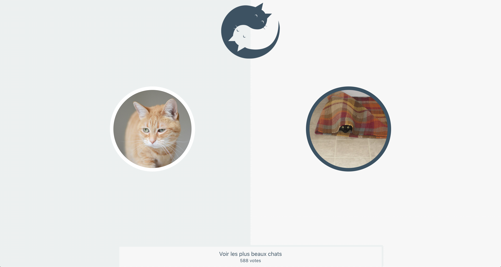

## Table of Contents

* [About the Project](#about-the-project)
  * [Built With](#built-with)
* [Getting Started](#getting-started)
  * [Prerequisites](#prerequisites)
  * [Installation](#installation)
* [Contributing](#contributing)
* [License](#license)
* [Contact](#contact)


<!-- ABOUT THE PROJECT -->
## About The Project


### Built With

* [Node](https://nodejs.org/dist/latest-v12.x/docs/api/)
* [React](https://fr.reactjs.org/)
* [Redux](https://redux.js.org/)
* [Sass](https://sass-lang.com/documentation/syntax)
* [Postgres](https://www.postgresql.org/)
* [Sqitch](https://sqitch.org/)
* [catsAtelierAPI]()

## Overview
 

## Demo


* [https://catmash-backend.herokuapp.com](https://catmash-backend.herokuapp.com)

<!-- GETTING STARTED -->
## Getting Started

### Prerequisites

* node
* postgres
* sqitch

### Installation

1. install server
* [https://github.com/decuyperanthony/catmash-atelier-back](https://github.com/decuyperanthony/catmash-atelier-back)

1. Clone the repo
```sh
git clone https://github.com/decuyperanthony/catmash-atelier--front
```


3. To init server
```sh
cp .env.example .env
npm install
npm start
```
4. Create postgres database
* username : catmash
* password : catmash
* database name : catmash
```sh
cd migrations
sqitch deploy
```


5. install client
* [https://github.com/decuyperanthony/catmash-atelier--front](https://github.com/decuyperanthony/catmash-atelier--front)


<!-- CONTRIBUTING -->
## Contributing
really ? :)


<!-- LICENSE -->
## License

Distributed under the MIT License. See `LICENSE` for more information.


<!-- CONTACT -->
## Contact

Anthony de Cuyper - [linkedin](https://www.linkedin.com/in/anthony-de-cuyper/) - decuyperanthony@gmail.com

Project Link: [https://github.com/decuyperanthony/star-wars](https://github.com/decuyperanthony/)
